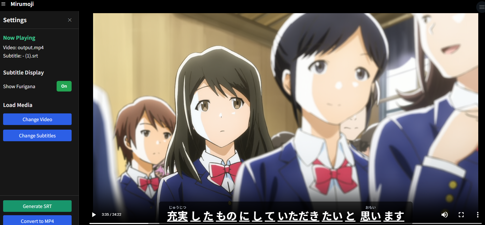
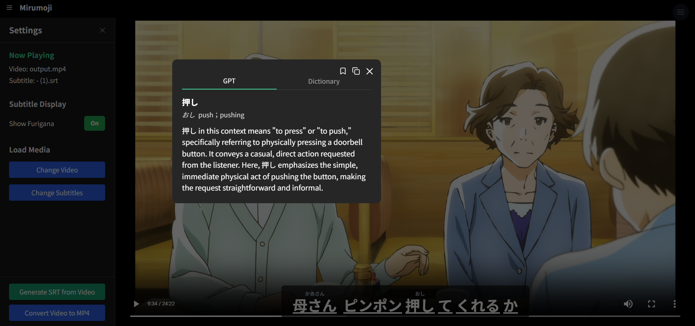
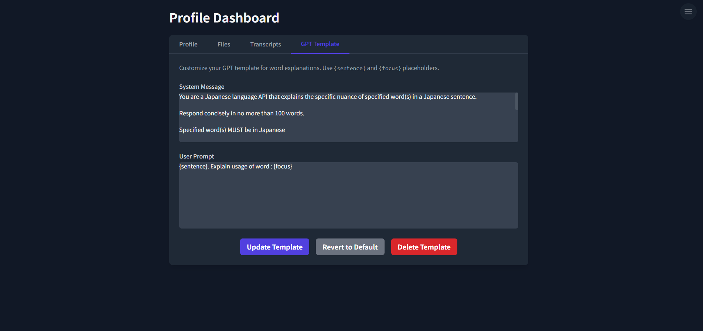
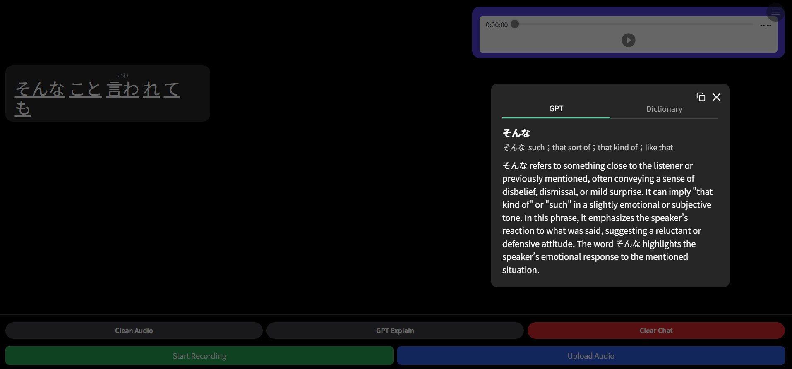
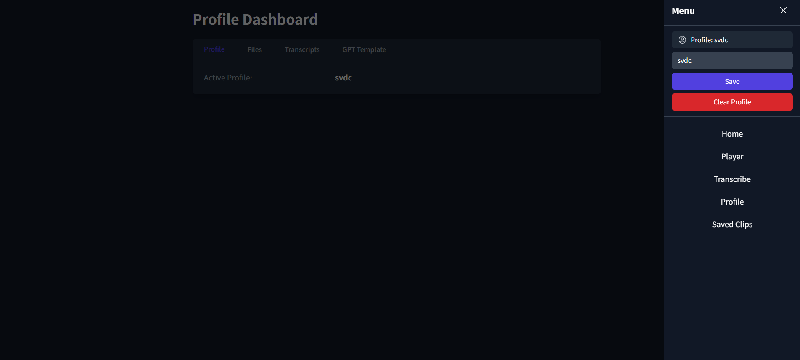
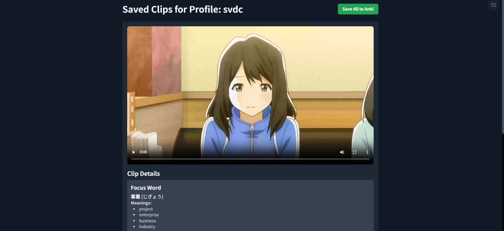

# Overview

> Open-Source Local Media Toolkit to help you learn Japanese from your favorite video and audio content.

> Optional [`OpenAI`](https://platform.openai.com/docs/overview) + [`Modal`](https://modal.com) Integration

## Features

> **Interactive Video Player**
>
> 
> Upload your local anime/J-Drama espisodes or any Japanese video and `.SRT` subtitles.

> **Clickable Japanese Subtitles**
>
> 
> Subtitles are tokenized ([`kuromoji.js`](https://github.com/takuyaa/kuromoji.js)), allowing you to click individual words with
> integrated offline JMDict for definitions.

> **OpenAI Integration**
>
> 
> Modify System Message and User Prompt with `{sentence}` and `{word}` variables.
> Requires OpenAI API Key.

> **Local Media Processing**
>
> > **Video Conversion**
> >
> > Upload videos in various formats; they can be converted to MP4 for optimal playback.
> >
> > **SRT Generation**
> >
> > Generate subtitles for your videos. Runs [FasterWhisper](https://github.com/SYSTRAN/faster-whisper) with modified parameters to increase accuracy for longer media such as Anime/ J-Drama episodes.

> **Audio Transcription**
>
> 
> Transcribe Japanese audio from recordings or uploaded files.

> **Profile-Based Data Management:**
>
> **Persistent Storage**
>
> 
>
> > Profile configurations and all other profile-related data is stored and managed via SQLite database by the backend.

> **Clip Saving**
>
> 
>
> > Save important video segments with their associated word breakdowns and export as an Anki Deck

---

## Setup

> Both the [frontend](https://github.com/svdC1/mirumoji_open_front) and [backend](https://github.com/svdC1/mirumoji_open_api) have pre-built [Docker](https://www.docker.com/) images which will be pulled if you choose to use the [docker-compose](https://docs.docker.com/compose/) setup method.

> You can also choose to [build](https://docs.docker.com/build/) the images locally with the Dockerfiles provided.

> **For detailed instructions please refer to the [Setup Guide](https://github.com/svdC1/mirumoji/wiki/Setup-Guide)**

---
