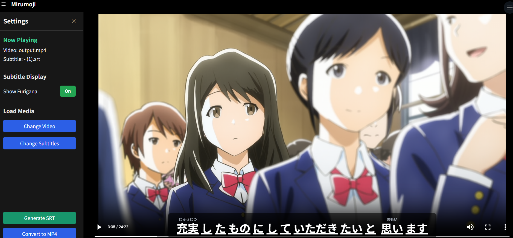
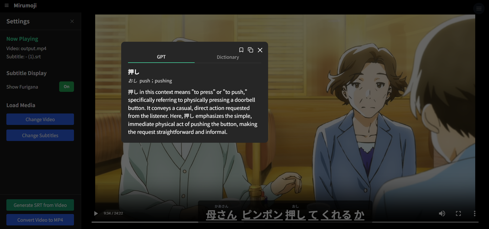
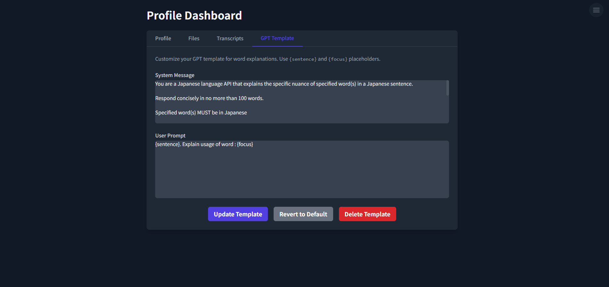
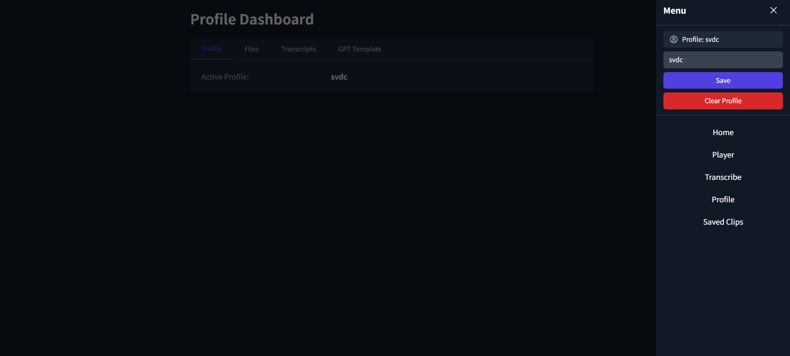
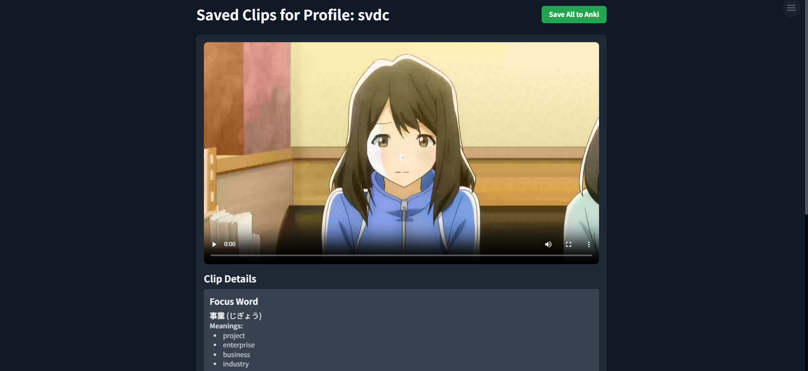

# Overview

> Mirumoji is an open-source, self-hosted Japanese immersion toolkit. Drop in any video, anime episode, drama or audio clip and it gives you: clickable tokenized subtitles with dictionary pop-ups, Whisper-powered transcription, instant SRT/clip extraction, and one-click Anki deck export — all in Docker, all running on your own machine.

> Optional [`OpenAI`](https://platform.openai.com/docs/overview) Integration - Customizable GPT Breakdowns of Subtitles -

> Optional [`Modal`](https://modal.com) Integration - Install a CPU only version and run all GPU tasks on the cloud -

---

# Features

## **Interactive Video Player**

> Upload your local anime/J-Drama espisodes or any Japanese video and `.SRT` subtitles.

## **Clickable Japanese Subtitles**

> Subtitles are tokenized ([`kuromoji.js`](https://github.com/takuyaa/kuromoji.js)), allowing you to click individual words with
> integrated offline JMDict for definitions.

## **OpenAI Integration**

> Modify System Message and User Prompt with `{sentence}` and `{word}` variables.

## **Local Media Processing**

### **Video Conversion**

> Upload videos in various formats; they can be converted to MP4 for optimal playback.

### **SRT Generation**

> Generate subtitles for your videos. Runs [`FasterWhisper`](https://github.com/SYSTRAN/faster-whisper) with modified parameters to increase accuracy for longer media such as Anime/ J-Drama episodes.

## **Audio Transcription**

> Transcribe Japanese audio from recordings or uploaded files.

## **Profile-Based Data Management:**

### **Persistent Storage**

> 

> Profile configurations and all other profile-related data is stored and managed via SQLite database by the backend.

### **Clip Saving**

> Save important video segments with their associated word breakdowns and export as an Anki Deck

---

# Setup

> Both the [`frontend`](https://github.com/svdC1/mirumoji/tree/main/apps/frontend) and [`backend`](https://github.com/svdC1/mirumoji/tree/main/apps/backend) have pre-built [`Docker`](https://www.docker.com/) images and are set up to work with Docker Compose.

> The easiest setup is to run the [`launcher`](https://github.com/svdC1/mirumoji/tree/main/apps/cli) for your platform. **For detailed instructions please refer to the [`Setup Guide`](https://github.com/svdC1/mirumoji/wiki/Setup-Guide)**

> You can also choose to [`build`](https://docs.docker.com/build/) the images locally with the Dockerfiles provided.

---
