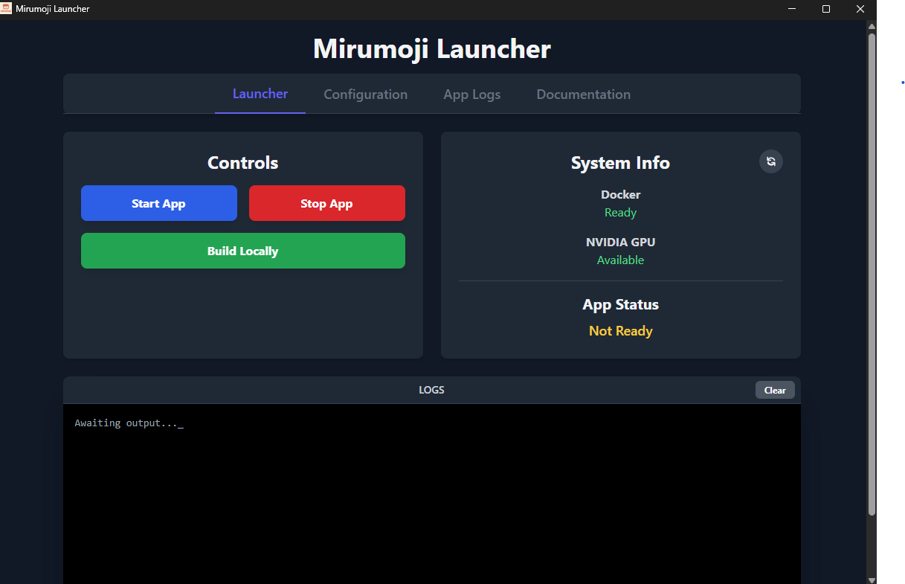
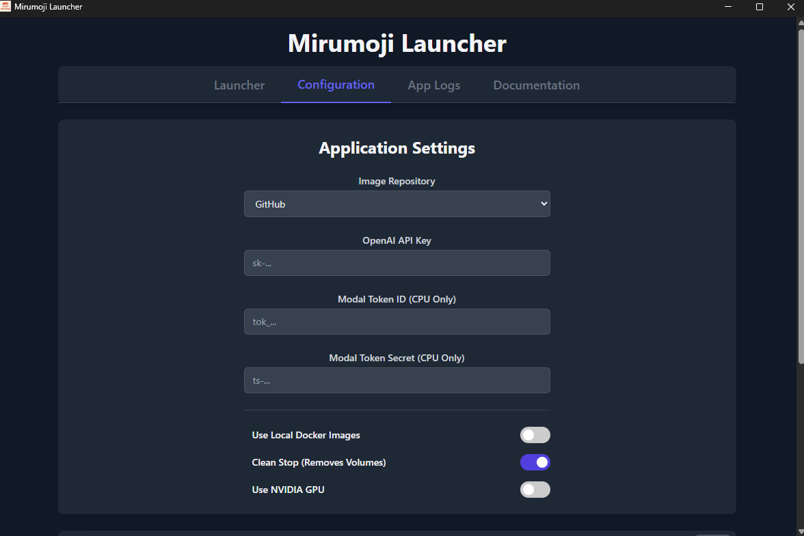
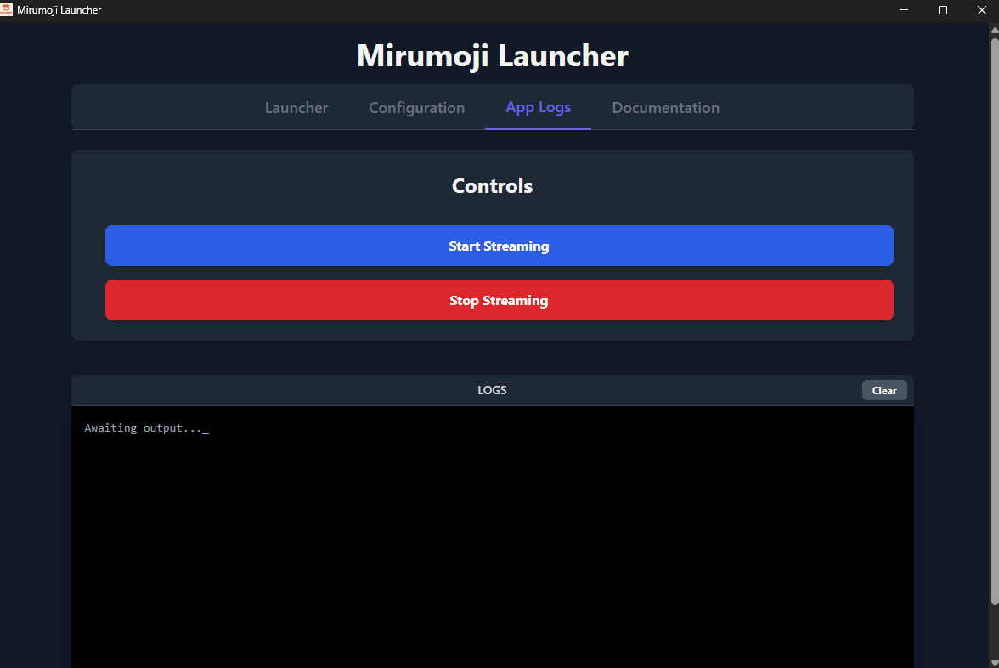

# Launcher GUI Guide

The Mirumoji Launcher (`mirumoji-gui`) is the recommended way to install, configure, and manage your Mirumoji application. It provides a user-friendly graphical interface that handles all the complex setup steps for you.

## Installation

> Download Links
>
> ### [`Windows`](https://github.com/svdC1/mirumoji/releases/latest/download/mirumoji-gui-windows.exe)
>
> ### [`Linux`](https://github.com/svdC1/mirumoji/releases/latest/download/mirumoji-gui-linux)
>
> ### [`MacOS`](https://github.com/svdC1/mirumoji/releases/latest/download/mirumoji-gui-macos.exe)

> The launcher is also distributed as a Python package and can be installed using `pip`.
>
> ```bash
> pip install mirumoji
> ```
>
> Once installed, you can run the GUI by simply executing the command:
>
> ```bash
> mirumoji-gui
> ```

## The Interface

The launcher is organized into three main tabs:

### 1. Launcher Tab

This is the main control panel for your application.



-   **Controls**:
    -   **Start App**: Starts the Mirumoji application using the settings from the Configuration tab.
    -   **Stop App**: Stops the Mirumoji application.
    -   **Build Locally**: Builds the necessary Docker images on your machine instead of downloading them. This is for more advanced use cases.
-   **System Info**:
    -   Shows the status of Docker and whether an NVIDIA GPU is detected. You can click the refresh button to re-check the status.
-   **App Status**:
    -   Indicates whether the main Mirumoji application is `Running`, `Not Ready`, or `Unhealthy`.

### 2. Configuration Tab

This tab allows you to configure all aspects of your Mirumoji installation before you start it.



-   **Image Repository**: Choose whether to download the pre-built Docker images from `GitHub` or `DockerHub`. (Default: GitHub).
-   **OpenAI API Key**: **(Required)** You must provide a valid OpenAI API key for the application's AI features to work.
-   **Modal Tokens (CPU Only)**: If you are running in CPU mode, you must provide your Modal Token ID and Secret. This is required for transcription tasks.
-   **Use Local Docker Images**: If toggled, the launcher will use images you built locally with the "Build Locally" button instead of pulling pre-built ones.
-   **Clean Stop**: If toggled, stopping the application will also remove all of its data (Docker volumes). This is useful for a fresh start.
-   **Use NVIDIA GPU**: If an NVIDIA GPU is detected on your system, this option will be available. Toggling it on will use the GPU-enabled backend for significantly faster AI performance.

### 3. App Logs Tab

This tab allows you to view the real-time logs from the running Mirumoji application, which is useful for monitoring its activity or debugging issues.



-   **Start/Stop Streaming**: Use these buttons to connect or disconnect from the log stream.

---

For advanced users who prefer the command line, see the [Advanced CLI Reference](./Advanced-CLI-Reference.md).
