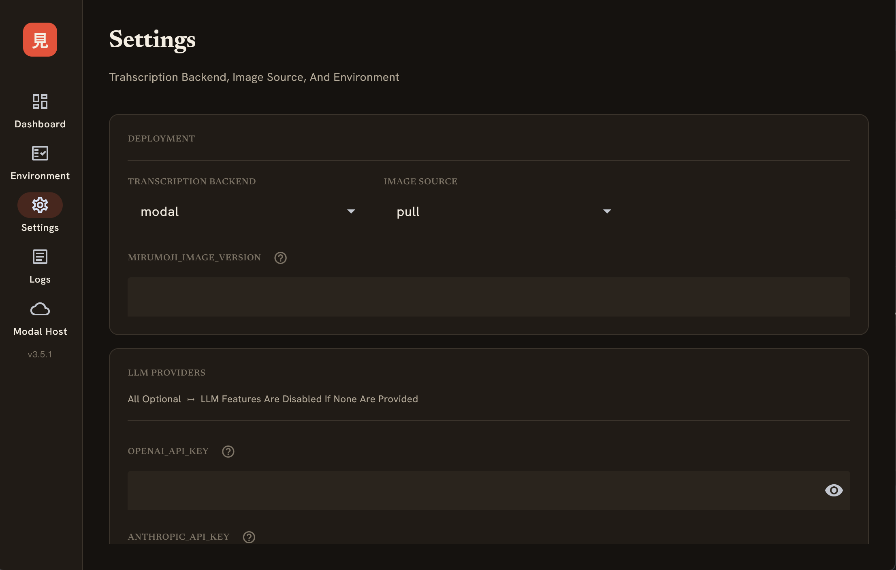

# Using a GPU

???+ question "Why Use A GPU"
    - Mirumoji transcribes audio with [`faster-whisper`](https://github.com/SYSTRAN/faster-whisper)
    and converts media with [`FFmpeg`](https://github.com/ffmpeg/ffmpeg)

    - For anything longer than a short clip, like an anime episode, or a podcast, that work is `MUCH` faster on  GPU than a CPU

    - Mirumoji was designed for long media, so it needs a GPU to power the transcription and media conversion operations

The [`Transcription Backend`](../setup/index.md#transcription-backends) option lets you choose where that work runs, so you don't need to own a GPU to run Mirumoji


| Backend | Needs | Best When |
| --- | --- | --- |
| **`modal`** | A Free [`Modal`](https://modal.com) Account | You don't have an `NVIDIA GPU`, or don't want to set one up |
| **`local`** | An `NVIDIA GPU` + the `NVIDIA Container Toolkit` | You have a capable `NVIDIA GPU` and want everything on your machine |

---

## Local NVIDIA GPU

Runs [`faster-whisper`](https://github.com/SYSTRAN/faster-whisper) directly on your own GPU inside the backend container

Everything stays on your machine. No cloud account is involved

???+ Requirements
    - An `NVIDIA GPU` with up-to-date drivers

    - The [`NVIDIA Container Toolkit`](https://docs.nvidia.com/datacenter/cloud-native/container-toolkit/latest/install-guide.html), which lets Docker Containers use the GPU

    - A few GB of disk for the GPU images + the transcription model, which
      downloads on the first transcription into a persistent cache volume and is
      reused on every run after that

!!! tip "Verify The Requirements On Your Machine"
    `Nvidia GPU` and `Nvidia Container Toolkit` should both report `ok`
    ```bash
    mirumoji doctor
    ```

### Configuration

Set the `Transcription Backend` option to `local` on the `CLI` or the `Desktop Launcher`

```bash
# CLI
mirumoji config set MIRUMOJI_TRANSCRIBE_BACKEND local
mirumoji up
```

---

## Modal (Cloud GPU)

This is the `default` backend because it works on any computer

[`Modal`](https://modal.com) runs code on cloud GPUs on-demand

The `free` tier includes a generous amount of monthly compute credits, which is plenty for personal use

???+ abstract "How It Works"
    - With the `modal` backend, Mirumoji runs its lightweight CPU image on your machine and
      `delegates` only the heavy transcription / conversion of media to short-lived `Modal`
      GPU containers

    !!! info "Step By Step Request Workflow"
        - You request a transcription / conversion on the frontend

        - The backend asks `Modal` to spin up an ephemeral `GPU` container running a fully-configured Mirumoji GPU Docker Image

        - The backend uploads the media into a short-lived `Modal` volume that the container reads from

        - The container runs the transcription / conversion work and returns the result (writing any converted file back to the same volume for the backend to retrieve)

        - The container shuts down and the temporary volume is discarded


### Get Your API Token Pair

=== "Through The Dashboard"
    - Sign Up At [`modal.com`](https://modal.com)

    - Click on `Settings` &rarr; `API Tokens`

    - Click `Create New`

    - Copy The `MODAL_TOKEN_ID` + `MODAL_TOKEN_SECRET`

=== "Through The Modal CLI"
    ```bash
    # If you already have a python environment running and a Modal Account
    pip install modal
    modal token new
    ```

### Configure Them In Mirumoji

=== "CLI Setup"
    ```bash
    mirumoji config set MIRUMOJI_TRANSCRIBE_BACKEND modal
    mirumoji config set MODAL_TOKEN_ID <your-token-id>
    mirumoji config set MODAL_TOKEN_SECRET <your-token-secret>
    mirumoji up
    ```

=== "GUI Setup"
    - In The Desktop Launcher, Enter `MODAL_TOKEN_ID` + `MODAL_TOKEN_SECRET` Under `Settings` &rarr; `Modal`

    - Click `Save Configuration`

    - Go Back To The Dashboard

    - Click `Up`

    <figure markdown>
    
    <figcaption>The Desktop Launcher's Settings Panel &rarr; Backend + Image Source + Provider Keys</figcaption>
    </figure>

### Tuning Modal (Optional)

| Variable | Default | What it does |
| --- | --- | --- |
| `MIRUMOJI_MODAL_GPU` | `A10G` | Which GPU The Modal Containers Run (`T4`, `L4`, `A10G`, `A100`, ...). See [`Modal's Available GPUs`](https://modal.com/docs/guide/gpu) |
| `MIRUMOJI_MODAL_SCALEDOWN_WINDOW` | `60` | Seconds To Keep An Idle Modal Container Warm Before It Scales Down (Faster Reuse In Continuous Use) |
| `MODAL_FORCE_BUILD` | `0` | Set To `1` To Force Modal To Rebuild Its Cached App Image (On Mirumoji Updates) |
| `MIRUMOJI_MODAL_IMAGE` | Which Image The Modal Containers Use | Override The Docker Image Used By The Modal Containers. &rarr; `Advanced` |

---
