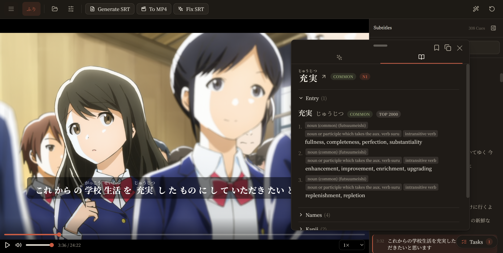
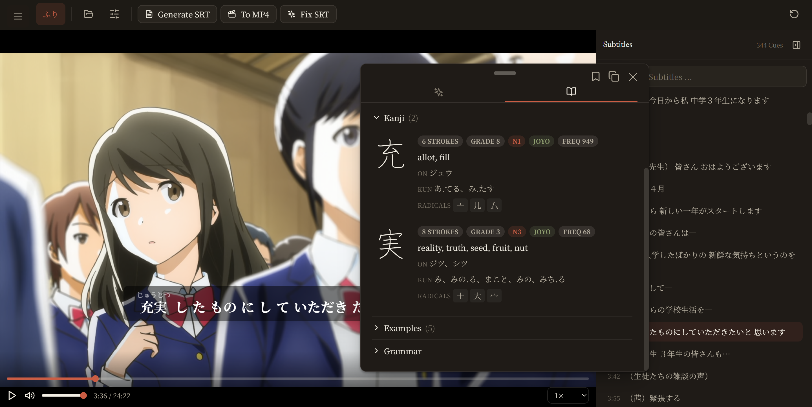
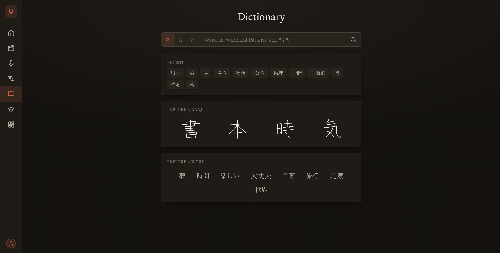
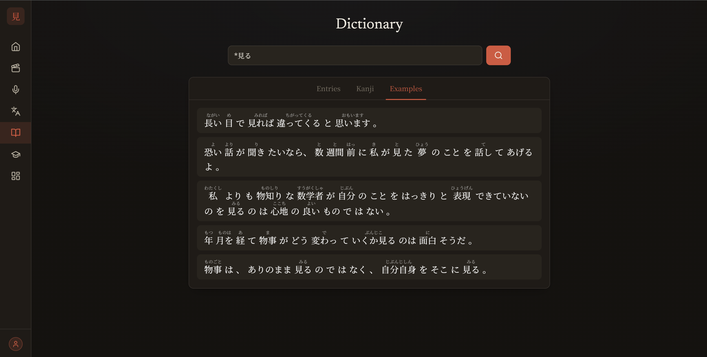
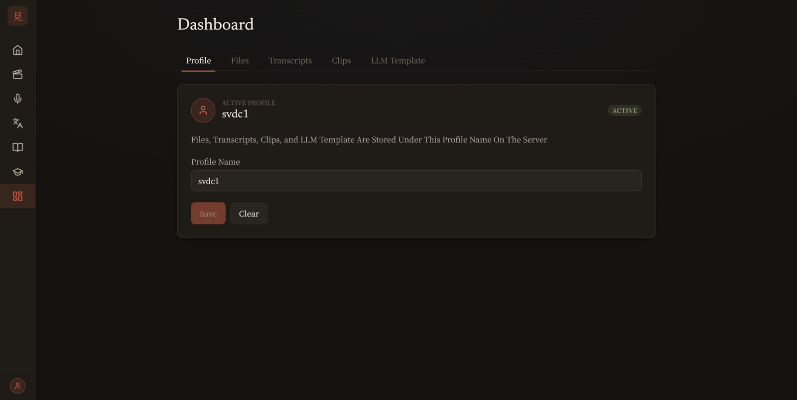
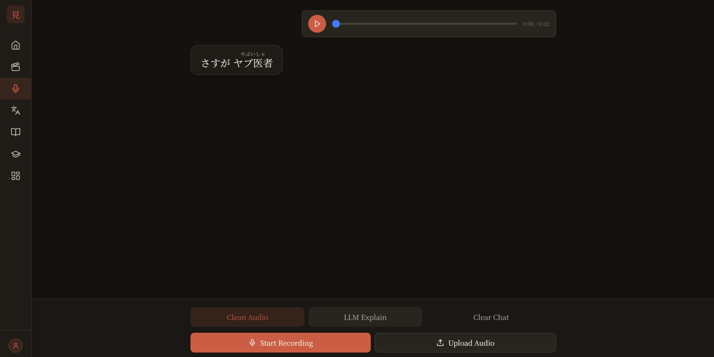
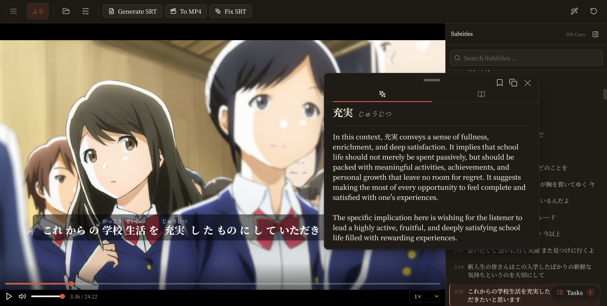
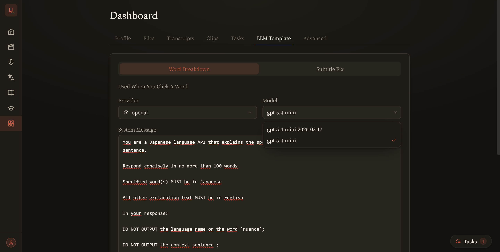
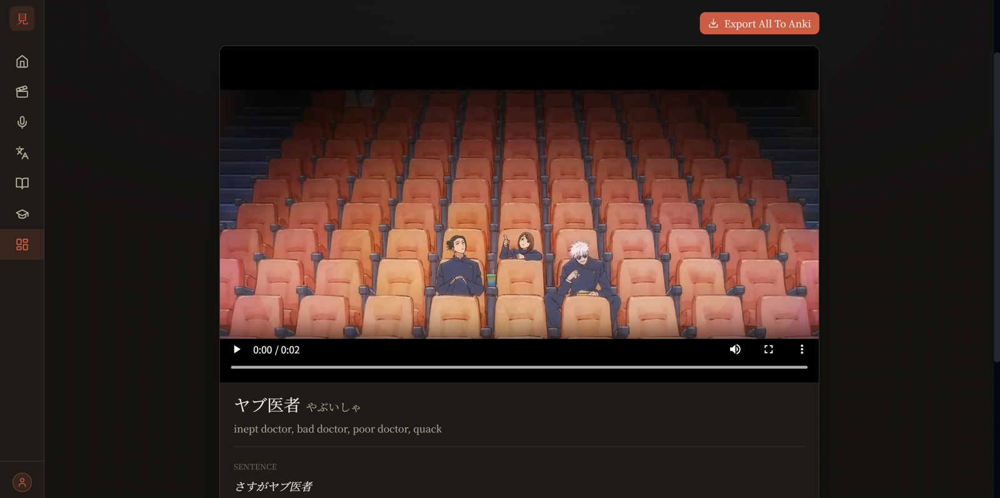
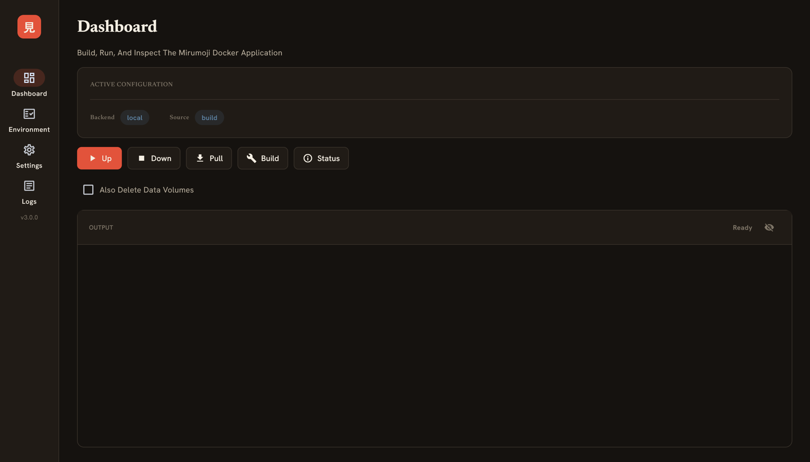

# Mirumoji

An open-source, self-hosted `Japanese Immersion Toolkit`

Drop in a video, an anime episode, a drama, or an audio clip and Mirumoji gives
you clickable tokenized subtitles with instant dictionary lookups whisper-powered
subtitle generation, clip saving, and Anki export. All running locally in Docker,
with optional cloud GPU and LLM features

[Get Started](setup/index.md){ .md-button .md-button--primary }
[Try the Live Preview](https://svdc1.github.io/mirumoji){ .md-button .md-button--primary }

---

## Features

<figure class="feature-slide" markdown>

<figcaption><strong>Interactive Video Player</strong> &rarr; Load any local video and
<code>.srt</code> subtitles, with synced, clickable Japanese lines</figcaption>
</figure>

<figure class="feature-slide" markdown>

<figcaption><strong>Clickable Subtitles</strong> &rarr; Subtitles are tokenized in the
server (UniDic). Click any word for readings, meanings, and contexts</figcaption>
</figure>

<figure class="feature-slide" markdown>

<figcaption><strong>Kanji Breakdown</strong> &rarr; Every lookup breaks down its kanji
with stroke counts, readings, and meaning (KANJIDIC2)</figcaption>
</figure>

<figure class="feature-slide" markdown>

<figcaption><strong>Dictionary</strong> &rarr; Wildcard search powered by
<a href="https://github.com/svdC1/kotobase">kotobase</a> (JMdict / JMnedict)</figcaption>
</figure>

<figure class="feature-slide" markdown>

<figcaption><strong>Example Sentences</strong> &rarr; Entries (Tatoeba) come with
furigana-annotated example sentences to see words in use</figcaption>
</figure>

<figure class="feature-slide" markdown>

<figcaption><strong>Profiles &amp; Data</strong> &rarr; Your files, transcripts, clips,
and LLM templates stay organized per profile on the server</figcaption>
</figure>

<figure class="feature-slide" markdown>

<figcaption><strong>Transcription</strong> &rarr; Transcribe audio or generate
subtitles with faster-whisper, locally or offloaded to a cloud GPU</figcaption>
</figure>

<figure class="feature-slide" markdown>

<figcaption><strong>LLM Breakdowns</strong>. Optionally use Gemini / Claude / GPT API Keys (or your own local LLM server) to generate sentence breakdowns</figcaption>
</figure>

<figure class="feature-slide" markdown>

<figcaption><strong>Custom LLM Prompts</strong> &rarr; Pick your provider and tailor the
breakdown prompt and system message per profile.</figcaption>
</figure>

<figure class="feature-slide" markdown>

<figcaption><strong>Clips &amp; Anki</strong> &rarr; Save video segments with their word
breakdowns and export them as an Anki deck </figcaption>
</figure>

<figure class="feature-slide" markdown>

<figcaption><strong>Desktop Launcher</strong> &rarr; The GUI starts and
manages the docker compose application for you</figcaption>
</figure>

---

## How It Works

???+ abstract "Services"
    Mirumoji Is A [`Docker Compose Application`](https://docs.docker.com/compose/) With Two Services

    - `Frontend` &rarr; A React app served over HTTPS that you open in any browser on your network

    - `Server` &rarr; A FastAPI backend that tokenizes Japanese, runs transcription, manages your profiles,
      and talks to optional cloud services

???+ info "Optional Features"
    Two capabilities are `optional` and entirely under your control. Everything else (your media, profiles, clips, and database) stays in your machine

    - `Transcription Backend` &rarr; Run [`faster-whisper`](https://github.com/SYSTRAN/faster-whisper) on your  local NVIDIA GPU or offload it to [`Modal`](https://modal.com) Cloud GPUs (CPU-Only Setup). See [`Using a GPU`](guides/gpu.md)
    
    - `LLM`  &rarr; Provide an `OpenAI`, `Anthropic`, `Gemini`, or `Custom
      OpenAI-Compatible` key to unlock AI sentence breakdowns + subtitle refinement. Without a key, those
      features are hidden

---

## Get Started

- :material-monitor: **[GUI Setup](setup/gui.md)**

    Download Desktop Launcher For Your Platform To Start, Stop, and
    Configure Mirumoji *(Easiest)*

- :material-console: **[CLI Setup](setup/cli.md)**

    Install With `pip` And Run The Docker Compose Application With `mirumoji up`
    *(For Those Who Prefer The Terminal)*

- :material-docker: **[Manual Setup](setup/manual.md)**

    Run The Docker Compose Commands Yourself, No Launcher
    *(More Configuration)*

- :material-book-open-variant: **[CLI Reference](cli.md)**

    Every `mirumoji` Command Explained

