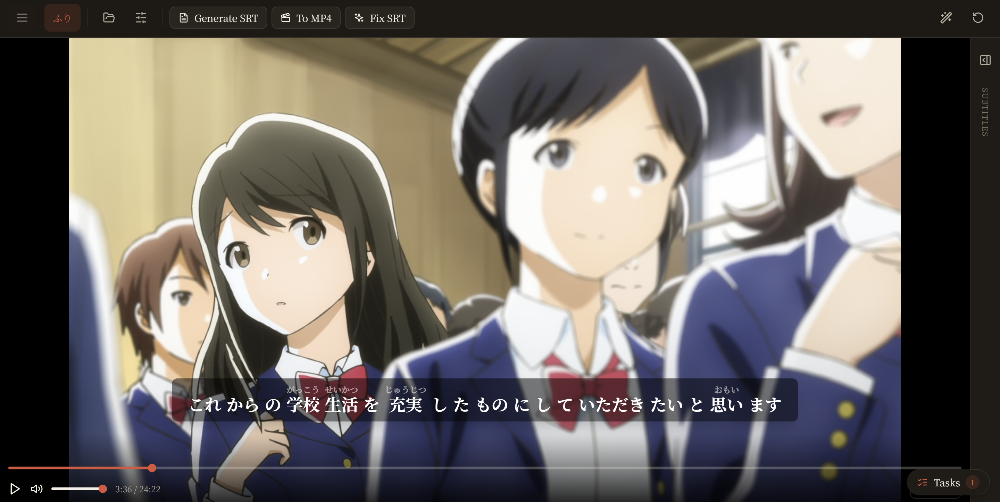

# CLI Setup

This page will teach you how to get mirumoji running using the `CLI` that comes with
its python package

!!! tip "Prerequisites"
    Make sure to read the initial [`Setup Page`](index.md) before following this guide

## Install

```bash
# Install The `mirumoji` command with pip (python>=3.10)
pip install mirumoji
```

!!! tip "Check Your Machine"
    ```bash
    mirumoji doctor
    ```

    - Confirms That Docker, Docker Compose, Git, NVIDIA GPU, NVIDIA Container Toolkit, Flet, And Flutter Are Available

    - Dependencies Vary Depending On The Chosen Transcription Backend

## Configure

Choose a [`Transcription Backend`](index.md#transcription-backends) and set any
keys it needs

=== "Modal"
    ```bash
    mirumoji config set MODAL_TOKEN_ID <your-token-id>
    mirumoji config set MODAL_TOKEN_SECRET <your-token-secret> # (1)!
    ```

    1. Optionally add an [`LLM Provider Key`](index.md#llm-features-optional)

=== "Local GPU"
    ```bash
    mirumoji config set MIRUMOJI_TRANSCRIBE_BACKEND local # (1)!
    ```

    1. Optionally add an [`LLM Provider Key`](index.md#llm-features-optional)


???+ tip "Viewing The Active Configuration"
    Review what you've set at any time by running
    ```bash
    mirumoji config show
    ```

## Run

```bash
mirumoji up
```

Open [`https://localhost`](https://localhost), accept the one-time self-signed
certificate warning, and you're ready to go

???+ question "How It Works"
    This command

    - Resolves The Transcription Backend Choice

    - Validates That Required Keys / External Dependencies Are Present

    - Builds The Correct Docker Compose File

    - Pulls The Docker Images

    - Runs `docker compose up`

    - Prints the local and LAN URLs

<figure markdown>

<figcaption>Mirumoji Running Locally</figcaption>
</figure>

!!! warning "First Run"
    - Pulling the images for the first time can take a few minutes

    - Subsequent starts are fast

## Useful Commands

```bash
mirumoji status # (1)!
mirumoji logs -f # (2)!
mirumoji down # (3)!
mirumoji down -v # (4)!
mirumoji config set <KEY> <VALUE> # (5)!
mirumoji config delete <KEY> # (6)!
mirumoji config show # (7)!
mirumoji config import ./my.env # (8)!
mirumoji config clear # (9)!
```

1. Show Running Services
2. Follow Logs (Optionally &rarr; `mirumoji logs backend`)
3. Stop The App
4. Stop And Delete All Data (Profiles, Media, Database)
5. Set Or Update One Variable
6. Remove One Variable
7. Print Current Config (Secrets Masked)
8. Merge an Existing `.env` File
9. Remove Everything

!!! tip "More Commands"
    See the [`CLI Reference`](../cli.md) for every command and flag

## Configuration

???+ info "Managed Configuration File"
    - The Launcher keeps your settings in a single, managed `.env` file which is shared by both the `CLI` and the  `GUI`

    - You can view where it's being stored by running `mirumoji config path`

    - It is `only` ever changed through `mirumoji config` commands or the `Save Configuration` button in the `GUI`

    - Other commands never modify it


## Updating

```bash
pip install --upgrade mirumoji
mirumoji pull  # refresh the Docker images
```
